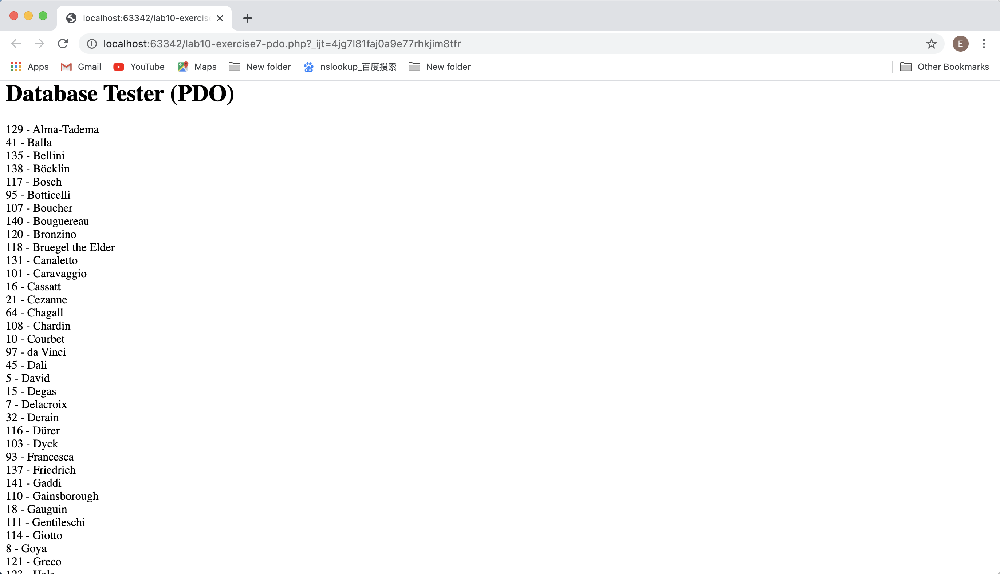
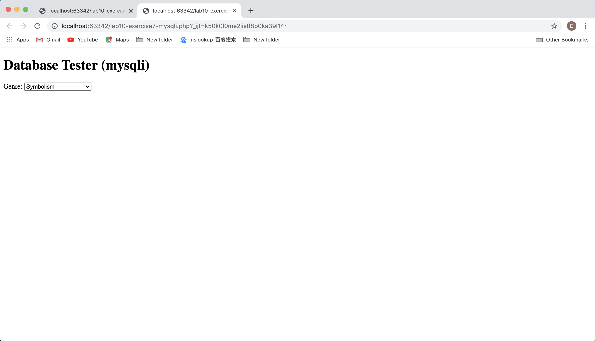
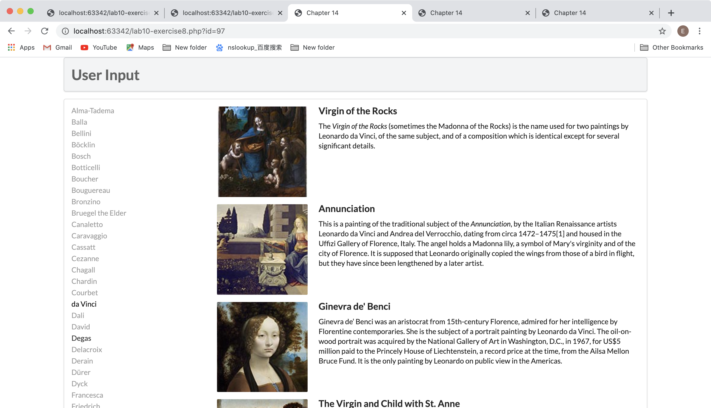
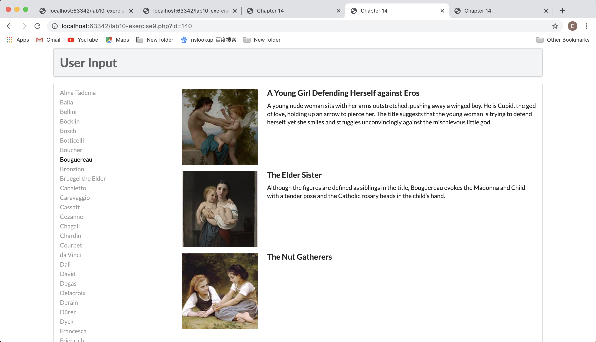
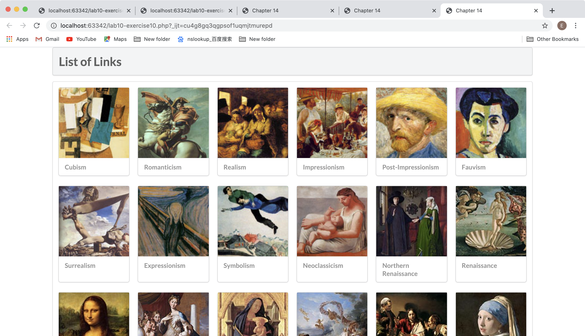
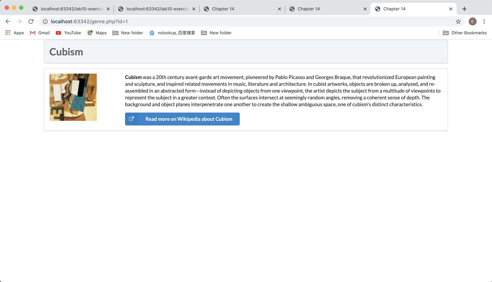

## Lab10 报告

姜尔玲 17307130291

### 概述

lab10的主要任务是学习使用xampp的phpMyAdmin和php文件完成网页对数据库中条目的访问、插入、删除等操作。

### 主要困难

##### 前期

在这个过程中，我主要遇到的困难在于前期；在lab9中没有使用xampp，所以这次刚开始做lab的时候，绕了很多弯路，最后选择了xampp，其中还有因为忘记mysql密码而弄的```乱七八糟```的东西。

虽然走了很多莫名其妙的弯路，但是对于过程中遇到的问题和解决方法感到更加熟悉，浪费了很多时间也还是有一点点小的收获。

### 具体过程

##### exercise 7

- 使用$pdo

  pdo是指PHP数据对象，通过代码：

  ```html
  $pdo = new PDO(DBCONNSTRING,DBUSER,DBPASS);
  ```

  利用PDO的实例创建了到mysql的数据连接，这个连接在PDO对象的生命周期内一直存在；可以通过将其设置为null手动提前关闭连接，否则连接会在脚本结束时断开。

  通过代码：

  ```html
  $sql = "select * from Artists order by LastName";
  $result = $pdo->query($sql);
  ```

  创建sql语句，利用PDO对象执行该sql语句，获得所有满足条件的条目（在这里是按照LastName排序的Artists中的所有条目）。

  通过代码：

  ```html
  while ($row = $result->fetch()) {
        echo $row['ArtistID'] . " - " . $row['LastName'] . "<br/>"; 
        }
  ```

  对所获得所有数据一条一条进行展示，展示其中的```ArtistID```和```LastName```。

  

- 使用mysqli

  MySQLi是指MySQL improved，MySQL函数是一组用来实现对数据的访问等操作的函数。

  和上面类似，通过代码：

  ```html
  $connection = mysqli_connect(DBHOST, DBUSER, DBPASS, DBNAME);
  $sql = "select * from Genres order by GenreName"; 
  ```

  我们首先创建了到数据库的连接，该函数返回一个代表到MySQL服务器的连接的对象；接着创建了对数据库进行访问的SQL语句。

  通过代码：

  ```html
  if ($result = mysqli_query($connection, $sql)) {
    // loop through the data
    while($row = mysqli_fetch_assoc($result)) {
       echo '<option value="' . $row['GenreID'] . '">'; 
       echo $row['GenreName'];
       echo "</option>";
    }
  ```

  我们获取了对该连接执行该SQL语句得到的条目，并利用```mysqli_fetch_assoc```函数依次获取了关联数组。

  通过代码：

  ```html
  mysqli_free_result($result);
  ```

  我们释放了之前获取的行；在mysqli_query()、mysqli_store_result() 或 mysqli_use_result()之后的执行是必需的。

  

##### exercise 8

第八题实现的是通过用户点击画家的姓名，获取对应的画家的作品信息并且展示在右侧。

- outputArtists()

  函数内使用的exercise7中学习的利用PDO的方法获取数据库的条目，并且展示在界面的左边。

- outputPaintings()

  函数中使用的也是exercise7中学习的利用PDO的方法获取数据库的条目，其中的SQL语句利用用户点击的左边的画家的id，选择其对应的painting的信息，并且对每个条目$row，调用函数utputSinglePainting($row)。

- outputSinglePainting($row)

  函数以outputPaintings()函数中获取的单条条目为参数，利用echo在页面中进行展示。



##### exercise 9

这个部分的目的和exercise8是一样的，区别在于执行sql语句的方式。具体的介绍如下。

1. exercise9利用了PDO对象的预处理语句。该类对象并不是通过NEW关键字实例化出来的，而是通过PDO对象中的prepare()方法，在数据库服务器中准备好一个预处理的SQL语句后直接返回的。
2. 通过执行PDO对象中的prepare()方法产生的PDOStatement类对象，则为一个查询对象，能定义和执行参数化的SQL命令。
3. 当以上内容完成，再通过bind加入参数或者利用占位符加入参数，完善sql语句，然后使用execute()函数执行该语句。

其优点在于：

1. 对于需要重复执行的sql查询，且存在部分参数不一致的情况时，使用预处理语句，会首先在数据库服务器中准备好“sql语句”，但并不马上执行，将对应的变量绑定到预处理的sql语句中，每次执行时会改变一些值，不会重复写sql语句，避免内存的浪费。
2. 结构和数据分离，更好的防治sql注入。



##### exercise 10

这个部分展示了所有的Genre信息，展示的信息包括图片和文字，且其中图片和文字都是可以点击实现跳转的。

- outputGenres()

  这一部分使用的仍然是PDO对象来进行数据库的连接和访问，且对于每一个访问到的条目$row，以其为参数调用outputSingleGenre($row)。

- outputSingleGenre($row)

  这一部分使用echo，利用图片的路径和名称实现基本的展示。

- constructGenreLink($id, $label)

  在outputSingleGenre($row)中使用的两处，利用label分别展示genre图片信息和genre的名字信息，且均是以```href="genre.php?id=' . $id . '"```为跳转目的地。



